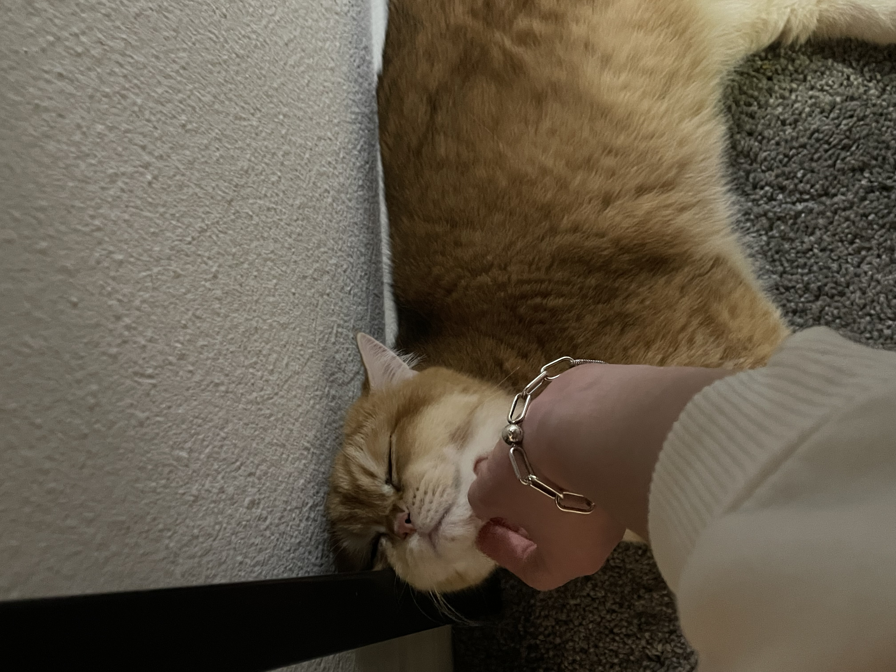
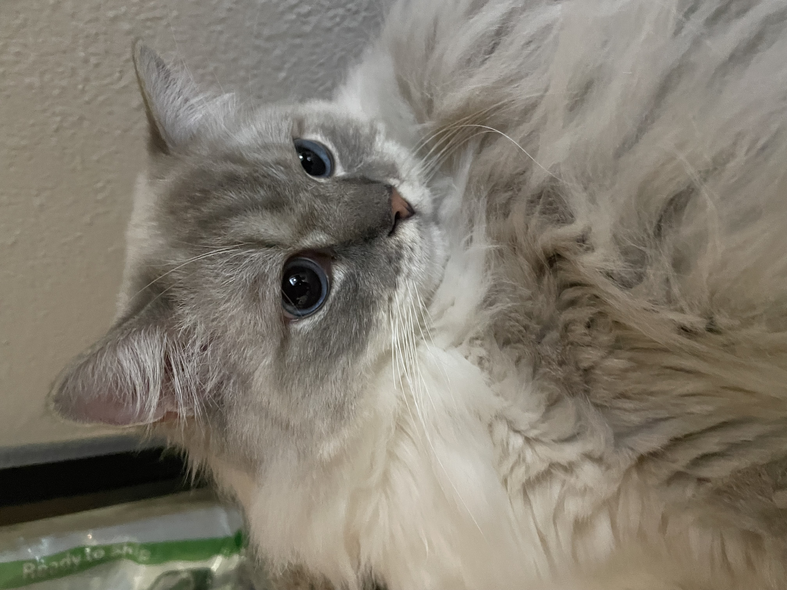

# Xin Shu's User Page
## My name is Xin Shu. I am a second-year student, majoring in math-cs in UCSD.

The programming language that I am familiar with:
- **Java**
- **Python**
- **C++**
- **JavaScript**

[My favorite programming language](README.md)

## About me
#### My instagram [the link to my ig](https://www.instagram.com/vickyyyshu/)
1. I am a cat lover and enjoy spending time with them. [link to my cats](#here-are-my-lovely-cats)
2. I enjoy cooking and baking and would like to explore new restaurants with my friends in my spare time.
   - I love hot pot and Korean BBQ
   - I also love baking and would like to try kinds of desserts.
3. I love outdoor exercise like skiing, surfing, diving, hiking and traveling.
4. I love photography and would like to be a photographer if not being a software engineer.
5. I am looking forward to learn more about software engineering and work as a group.

## Things to do before I die
- [x] Fall in love
- [ ] Go to space
- [ ] Donate blood
- [ ] Get married
- [ ] Run a successful business
- [x] Accept a dare
- [ ] Take a long hot bubble bath, light some candles, play some music
- [x] Pet cat
- [x] A trip without plan
- [ ] Get a college degree

## Here are my lovely cats 
> Pancake

> Princess

```
"They are all very well-behaved, clingy, and friendly, and they like people to pet them."
```
